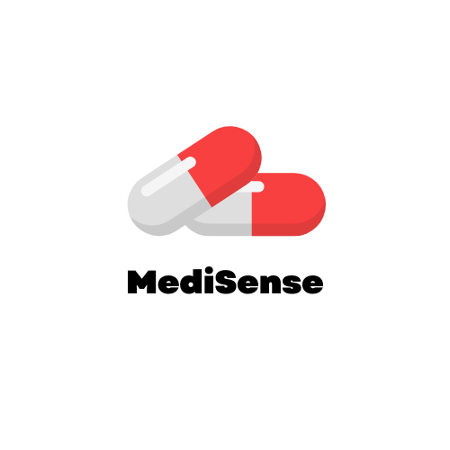
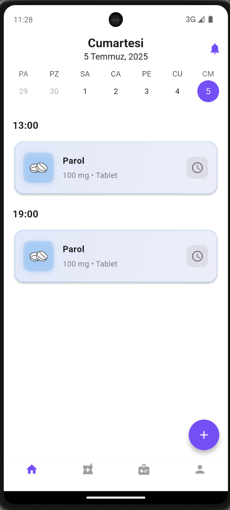
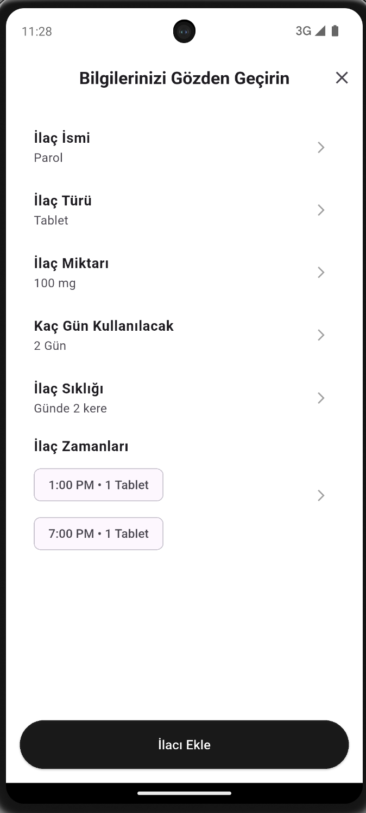
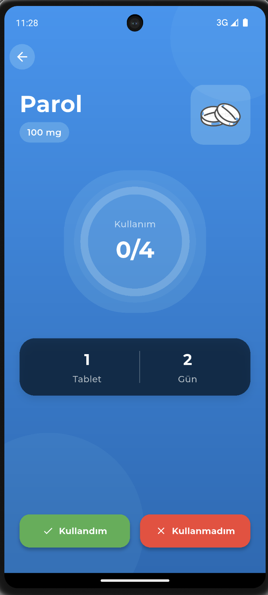
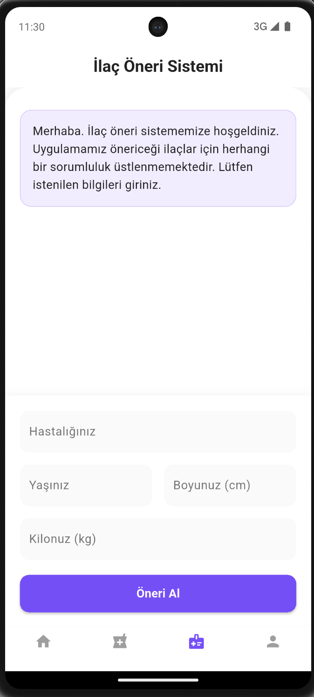
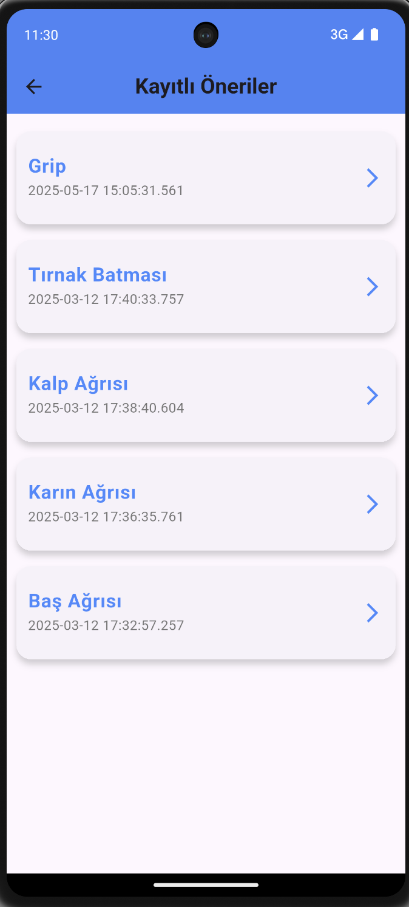
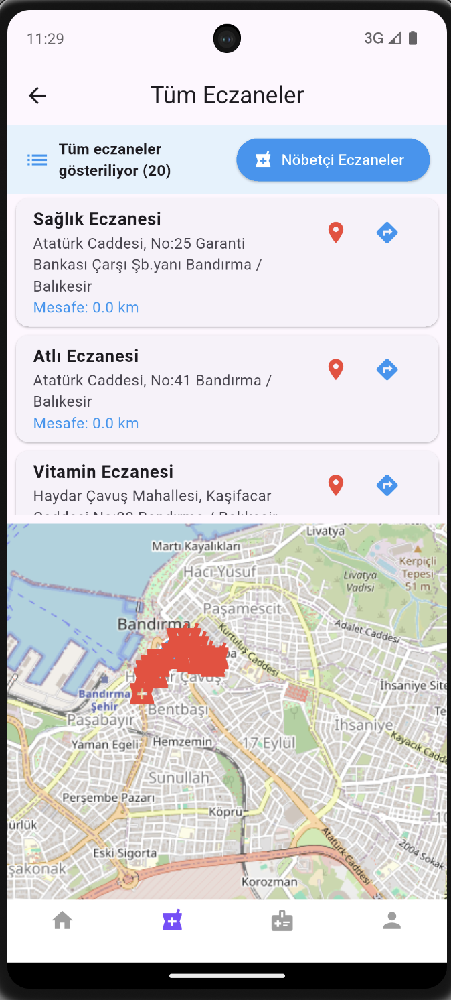
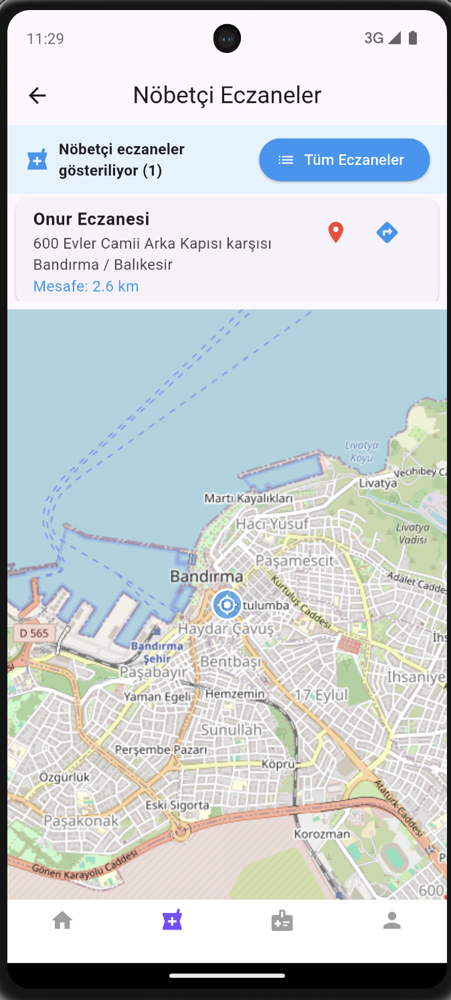

# MediSense - İlaç Takip, Bildirim ve Öneri Uygulaması

<div align="center">
  
</div>

## 📱 Proje Hakkında

MediSense, kullanıcıların ilaçlarını düzenli olarak takip etmelerini sağlayan, akıllı hatırlatmalar ve öneriler sunan kapsamlı bir mobil sağlık uygulamasıdır. Uygulama, ilaç kullanımını kolaylaştırmak ve sağlık yönetimini iyileştirmek amacıyla geliştirilmiştir.

## ✨ Özellikler

### 🔐 Kullanıcı Yönetimi
- **Kayıt ve Giriş**: Firebase Authentication ile güvenli kullanıcı hesabı oluşturma
- **Profil Yönetimi**: Kişisel bilgileri düzenleme ve güncelleme

### 💊 İlaç Takibi
- **İlaç Ekleme**: Detaylı ilaç bilgileri ile ilaç kaydı oluşturma
- **Takvim Görünümü**: Günlük, haftalık ve aylık ilaç takip takvimi
- **İlaç Detayları**: Her ilacın detaylı bilgilerini görüntüleme ve düzenleme
- **Zaman Yönetimi**: İlaç alma saatlerini özelleştirme

### 🔔 Akıllı Bildirimler
- **Hatırlatmalar**: İlaç alma zamanlarında otomatik bildirimler
- **Bildirim Geçmişi**: Tüm bildirimleri görüntüleme ve yönetme
- **Özelleştirilebilir Bildirimler**: Bildirim türü ve sıklığını ayarlama

### 🏥 Eczane Hizmetleri
- **Yakındaki Eczaneler**: Konum bazlı eczane bulma
- **Harita Entegrasyonu**: Google Maps ile eczane konumlarını görüntüleme
- **Eczane Bilgileri**: İletişim bilgileri ve çalışma saatleri

### 🤖 AI Destekli Öneriler
- **İlaç Önerileri**: Google Generative AI ile akıllı ilaç önerileri
- **Kişiselleştirilmiş Öneriler**: Kullanıcı geçmişine göre özelleştirilmiş öneriler
- **Sağlık İpuçları**: Genel sağlık ve ilaç kullanımı hakkında bilgiler

### 📊 Veri Yönetimi
- **Bulut Depolama**: Firebase Firestore ile güvenli veri saklama
- **Gerçek Zamanlı Senkronizasyon**: Verilerin anlık güncellenmesi
- **Yedekleme**: Otomatik veri yedekleme ve geri yükleme

## 🛠️ Kullanılan Teknolojiler

### Frontend
- **Flutter 3.5+**: Cross-platform mobil uygulama geliştirme
- **Dart**: Programlama dili
- **Material Design**: Modern ve kullanıcı dostu arayüz

### Backend & Veritabanı
- **Firebase Authentication**: Kullanıcı kimlik doğrulama
- **Firebase Firestore**: NoSQL veritabanı
- **Firebase Storage**: Dosya depolama
- **Firebase Cloud Functions**: Sunucu tarafı işlemler

### Harita ve Konum
- **Google Maps Flutter**: Harita entegrasyonu
- **Geolocator**: Konum servisleri
- **Geocoding**: Adres çözümleme

### AI ve Bildirimler
- **Google Generative AI**: Yapay zeka destekli öneriler
- **Firebase Cloud Messaging**: Push bildirimleri
- **Flutter Local Notifications**: Yerel bildirimler

### Diğer Kütüphaneler
- **Provider**: State management
- **HTTP**: API istekleri
- **Table Calendar**: Takvim widget'ı
- **Image Picker**: Resim seçimi
- **URL Launcher**: Harici link açma
- **Intl**: Uluslararasılaştırma
- **Google Fonts**: Özel yazı tipleri

## 📱 Ekran Görüntüleri

<div align="center">
  <h3>Uygulama Arayüzü</h3>
</div>

### 🏠 Ana Sayfa
<div align="center">
  
  <p><em>Günlük ilaç takibi ve takvim görünümü</em></p>
</div>

### 💊 İlaç Ekleme
<div align="center">
  
  <p><em>Yeni ilaç kaydı oluşturma ekranı</em></p>
</div>

### 📋 İlaç Detay Sayfası
<div align="center">
  
  <p><em>İlaç bilgilerini görüntüleme ve düzenleme</em></p>
</div>

### 🤖 İlaç Önerileri
<div align="center">
  
  <p><em>AI destekli akıllı ilaç önerileri</em></p>
</div>

### 💡 Kayıtlı Öneriler
<div align="center">
  
  <p><em>Daha önce alınan önerilerin listesi</em></p>
</div>

### 🏥 Tüm Eczaneler
<div align="center">
  
  <p><em>Harita üzerinde yakındaki eczaneler</em></p>
</div>

### 🌙 Nöbetçi Eczaneler
<div align="center">
  
  <p><em>Gece nöbetçi eczane bulma servisi</em></p>
</div>

## 🚀 Kurulum ve Çalıştırma

### Gereksinimler
- Flutter SDK 3.5.0 veya üzeri
- Dart SDK
- Android Studio / VS Code
- Firebase hesabı
- Google Cloud Console hesabı

### Adım 1: Projeyi Klonlayın
```bash
git clone https://github.com/your-username/medisense-app.git
cd medisense-app
```

### Adım 2: Bağımlılıkları Yükleyin
```bash
flutter pub get
```

### Adım 3: Firebase Yapılandırması
1. Firebase Console'da yeni bir proje oluşturun
2. Android ve iOS uygulamalarını ekleyin
3. `google-services.json` dosyasını `android/app/` klasörüne ekleyin
4. `GoogleService-Info.plist` dosyasını `ios/Runner/` klasörüne ekleyin
5. Firebase CLI ile projeyi yapılandırın:
```bash
firebase login
firebase init
```

### Adım 4: API Anahtarlarını Yapılandırın
- Google Maps API anahtarını `android/app/src/main/AndroidManifest.xml` dosyasına ekleyin
- Google Generative AI API anahtarını gerekli servis dosyalarına ekleyin

### Adım 5: Uygulamayı Çalıştırın
```bash
flutter run
```

## 📁 Proje Yapısı

```
lib/
├── main.dart                 # Uygulama giriş noktası
├── firebase_options.dart     # Firebase yapılandırması
├── models/                   # Veri modelleri
│   ├── medication.dart
│   ├── medication_provider.dart
│   └── pharmacy.dart
├── services/                 # Servis katmanı
│   ├── auth.dart
│   ├── notification_service.dart
│   └── pharmacyservice.dart
└── views/                    # UI ekranları
    ├── splash_screen.dart
    ├── onboarding_screen.dart
    ├── login_screen.dart
    ├── sign_up_screen.dart
    ├── home_screen.dart
    ├── add_medicine_screen.dart
    ├── medication_details_screen.dart
    ├── notifications_screen.dart
    ├── pharmacy_screen.dart
    ├── drug_recommendation_screen.dart
    ├── profile_screen.dart
    └── edit_profile_screen.dart
```

## 🔧 Yapılandırma

### Firebase Yapılandırması
- Authentication: Email/Password ve Google Sign-In
- Firestore: Kullanıcı verileri, ilaç kayıtları
- Storage: Profil resimleri ve ilaç görselleri
- Cloud Functions: Bildirim gönderimi ve AI işlemleri

### Bildirim Yapılandırması
- Yerel bildirimler: İlaç hatırlatmaları
- Push bildirimleri: Önemli güncellemeler
- Zamanlanmış bildirimler: Günlük ilaç takibi

## 🤝 Katkıda Bulunma

1. Bu repository'yi fork edin
2. Yeni bir branch oluşturun (`git checkout -b feature/amazing-feature`)
3. Değişikliklerinizi commit edin (`git commit -m 'Add some amazing feature'`)
4. Branch'inizi push edin (`git push origin feature/amazing-feature`)
5. Pull Request oluşturun

## 📄 Lisans

Bu proje MIT lisansı altında lisanslanmıştır. Detaylar için `LICENSE` dosyasına bakın.

## 📞 İletişim

- **Geliştirici**: [Adınız]
- **Email**: [email@example.com]
- **LinkedIn**: [LinkedIn Profiliniz]
- **GitHub**: [GitHub Profiliniz]

## 🙏 Teşekkürler

- Flutter ve Dart ekibine
- Firebase ekibine
- Google Maps ve AI servisleri ekibine
- Açık kaynak topluluğuna

---

<div align="center">
  <p>❤️ Sağlıklı günler dileriz!</p>
</div>
